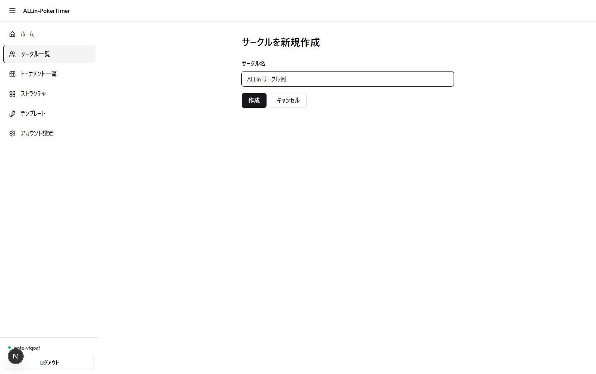

# ALLin-PokerTimer サークル開設ガイド

ALLin-PokerTimer を自分のサークルで初めて使う**オーナー（運営者代表）向け**のページです。
「アカウントを作って、自分のサークルを立ち上げて、仲間を呼んで、運営を 1 人増やす」までを上から順に並べました。

> アプリの全体像を知りたい方 → [ご紹介記事（こちら）](note-article.md)
> 当日の進行操作（タイマー・バランシング・PD 等）→ [運営チートシート（こちら）](operating-guide.md)

---

## 0. アカウントを作って表示名を入れる

サークル作成にはログインが必要です。登録方法は次の 2 通り。

- **Google で登録** — 1 タップ。表示名は Google プロフィールから自動取得されます
- **メール + パスワードで登録** — フォーム内に **表示名（必須・15 文字以内）** の入力欄があり、ここで入れた名前がそのまま席表・参加者一覧に出る名前になります（空欄では登録できません）

> 表示名は後から変更可能です。

---

## 1. サークルを新規作成する

ログイン後、左サイドバー → 「サークル」 → 「新規作成」を開きます。

- 入力するのは **サークル名 1 つだけ**（最大 60 文字）
- 「作成」ボタンを押した瞬間、あなたが**オーナー**として登録されます
- 作成後は自動で サークル詳細画面に遷移し、ここからの操作はすべてこのサークル単位で行います

> サークル名は後から変更可能（オーナーのみ）。仮の名前で作って、後でメンバーに諮ってからリネームする運用で問題ありません。

---

## 2. サークル詳細画面の歩き方

作成直後のサークル詳細画面は、メンバーがあなた 1 人だけの状態です。
ここで使うブロックは大きく分けて 3 つ。

- **ヘッダ** — サークル名（鉛筆アイコンから rename）、メンバー数 / オーナー数、自分の権限バッジ
- **「メンバー」カード** — 現在の所属者一覧と各人の権限。オーナーだけが昇降格ボタンを操作できます
- **「招待コード」カード** — メンバーを呼ぶための URL / QR を発行する場所

タブ切替で **「設定」「シーズン」** にも入れますが、最初のセットアップでは「メンバー」「招待コード」を中心に触ります。

---

## 3. 招待コードを発行して、メンバーを呼ぶ

「招待コード」カードの **「招待コードを発行」** ボタンを押すと、

- **加入用 URL** が生成されます（コピー用ボタン付き）
- 同じ URL の **QR コード** が自動で並んで表示されます
- 有効期限は **7 日間**
- 加入できる人数の上限はなし

共有方法は 3 通り、好きなものでどうぞ。

- **サークルの LINE / Discord に URL を貼る** — 一斉に届く
- **対面で QR を読んでもらう** — その場で全員加入
- **個別に URL を送る** — 招待相手を絞れる

> 同じ URL で複数人が加入できます。「1 人 1 リンク」ではないので、サークル全体にまとめて投げる用途に向きます。
> もう一度「招待コードを発行」を押すと**新しいコードが発行**され、古いコードは無効になります（不要になったコードはこの操作で失効させてください）。

---

## 4. 加入直後のメンバーは「一般メンバー」スタート

招待リンクから加入した人は、**例外なく「一般メンバー」権限**で登録されます。

| 権限 | できること |
| --- | --- |
| **オーナー** | サークル名変更 / メンバーの権限変更 / 招待コード発行 / サークル削除 / 全 CRUD |
| **運営担当** | 招待コード発行 / 当日のトーナメント作成・進行・編集 / ストラクチャ管理 |
| **一般メンバー** | トーナメントの閲覧と参加のみ（運営操作は不可） |

つまり、招待コードを共有しただけでは「みんな一般メンバーで入ってきている」状態。
当日プレイヤーを兼ねた**運営担当**を増やすには、次の権限付与の操作が要ります。

---

## 5. 運営担当 / オーナーに昇格させる

「メンバー」カードのメンバー行右端に、オーナーの目にだけ昇降格ボタンが見えます。

- **一般メンバー** に対しては「**運営へ昇格**」ボタン
- **運営担当** に対しては「**オーナーへ昇格**」「**一般へ降格**」ボタン
- **オーナー** に対しては「**運営へ降格**」ボタン

直接「一般メンバー → オーナー」には飛べません。**先に運営担当へ昇格 → オーナーへ昇格**の 2 段階で上げます。

> 自分自身の行には昇降格ボタンが出ません（誤操作で自分を一般メンバーに落とすことが起きないように）。
> オーナーを増やしたい場合は、他のオーナーに自分を昇格してもらうことになります。

---

## 6. オーナーは複数人にしておくと安心

オーナーは複数設定できます。1 人だけにしておくと、

- そのオーナーがログインできない日にサークル設定の変更ができない
- そのオーナーがアプリのアカウントを削除すると、サークルを失う

という弱点があります。共同運営者が 1 人いる場合は、開設後すぐに**オーナーを 2 人**にしておくのが楽です。

> **最後のオーナーは降格・脱退できません。** 自動的に保護されていて、「運営へ降格」ボタンは無効化されます。アカウント自体を削除しようとすると「先に他のオーナーを立てる必要があります」と警告が出ます。

---

## 7. 「事前に決めておくと当日が楽」な初期設定

サークル詳細の **「設定」タブ**で、当日触らずに済む既定値を 1 度だけ整えておけます（オーナー / 運営担当のみ操作可）。

- **デフォルト席数** — トーナメント新規作成画面の初期値（既定 8 / 範囲 2〜10）
- **定番の卓名と色** — 「赤卓」「窓側」など、毎回使う卓ラベルを保存。新規トーナメントで自動的に当てはまります
- **優勝者カード / シーズン戦績カード の背景画像** — SNS 共有用 PNG の見た目を上書き
- **サウンド設定** — ブラインド昇格時の通知音

> 全部今やる必要はありません。初回は **デフォルト席数**だけ合わせておいて、残りは当日の経験を元に少しずつ詰めても十分です。
> **シーズン戦績まわりの初期設定**（ポイント計算ルール / シーズン開始）は、このアプリの売り機能なので次の節で別立てで扱います。

---

## 8. シーズン戦績管理 — サークル運営を盛り上げよう！

ALLin-PokerTimer は、**サークル単位のシーズン累計戦績**をアプリ側が勝手に集計します。
月 1〜2 回開催のサークルだと開催間隔が空くうちに「先月誰が勝ったっけ？」の記憶が薄れますが、ここを完全に埋めてくれるのが本アプリの押しどころです。

### 自動で記録されるもの

- **参加回数 / 優勝回数 / FT（ファイナルテーブル）回数 / 累計ポイント** が、トーナメント終了と同時に取り逃しなく加算されます
- ポイントは **順位 × 参加人数係数** で計算。6 人開催の 1 位と 24 人開催の 1 位できちんと重みが付きます
- サークル詳細の **「シーズン」タブ**から、全メンバーがシーズンランキングを閲覧可能
- 過去シーズンは **履歴ページから個別に振り返れます**

### 開設時に 1 度だけやっておくこと

1. **シーズンポイント計算ルールを揃える**（設定タブ）— 順位ごとの基礎点（最大 9 位まで）と基準人数（2〜10 人）。デフォルトのまま運用してもよいですが、サークル内で議論になりやすい数字なので、開設直後にメンバーと合意しておくと後が楽です
2. **「シーズンを開始する」ボタンを押す**（シーズンタブ）— 押した瞬間からシーズンが始まり、以降の終了したトーナメントが累計に加算されます。押さない限りシーズンの開始日が記録されないので、開設直後に 1 度押して**第 1 シーズンの起点**を切っておくのを推奨

> ⚠️ 進行中（受付・進行中・一時停止）のトーナメントがあると「シーズンを開始する」はエラーで止まります。先にトーナメントを終了させてから押してください。

### シーズンを区切るとき

- サークル詳細の **「シーズンを開始する」** ボタンを再度押すと、現状の戦績が**過去シーズンとして履歴保存**され、新シーズンが 0 から始まります
- 過去シーズンには遡及してポイントルール変更を適用しません。ルールを大きく変えるときは「シーズンを開始する」で reset するのが筋

### 結果カード PNG で SNS に貼る

トーナメント終了時の**優勝カード**と、シーズンランキング画面の**シーズン首位カード**は、それぞれ **「画像を保存」** ボタンで PNG として手元に降りてきます。サークルの LINE / Discord にそのまま貼れる体裁で出力されるので、月 1〜2 開催の盛り上がりを画像 1 枚で次回開催までつなぎ止められます。

### 結果カードを「自分のサークル専用」に仕立てる（オーナーのみ）

優勝カード / シーズン戦績カードの**背景画像は、サークルごとに別々に設定**できます。以下のデフォルトから差し替えることで、「ただの汎用カード」ではなく**そのサークル固有のカード**になり、SNS 共有時の見栄えと帰属感が一段上がります。

サークル詳細 → **設定タブ** → 「優勝者カード背景画像」 / 「シーズン戦績カード背景画像」 から差し替え（**オーナーのみ操作可**）。

- **おすすめ条件**: 1200×630 比率 / 5MB 以下。中央付近に大きな優勝者名、最下部に情報ボックス（サークル名 / 開催日 / 参加人数 / アプリ名）が乗るので、**主役の被写体や文字が中央〜下部に来ない画像**が無難
- **ライト / ダークテーマ切替**: 背景の明るさに合わせて、テキスト色（黒 / 白）と最下部情報ボックスの色を切替可能
- **保存前プレビュー**: 設定画面のプレビュー領域で「文字が読めるか」「主役の被写体が隠れていないか」を確認してから保存
- **解除**: 「背景を解除」ボタンで固定グラデーション背景に戻せます

> サークルのロゴ・会場の集合写真・コミュニティのアイコン画像などを背景にすると、SNS で流れたとき**一目で「あのサークルの戦績だ」と分かる**カードになります。

---

## 9. オーナーが最初にやっておきたい運用のコツ

- **PWA（ホーム画面に追加できるアプリ）** を入れておく — 当日のタイマー安定性が段違いになるので、自分とサブのオーナー / 運営担当には事前にお願いしておく（[operating-guide.md](operating-guide.md) の冒頭参照）
- **ストラクチャを 1 つ用意** — 「Friday Night Default」のように 1 度作っておけば、以降のトーナメント作成は数十秒で終わります（左サイドバー → 「ストラクチャ」 → 新規作成 / もしくは公開テンプレートを取り込む）

---

## 10. ここまで終わったら

サークルが立ち上がり、運営担当も任命できたら、次に必要なのは**当日の進行操作**です。

- 当日 5 ステップ / 受付の流れ / バランシング / PD / 観戦モード / 結果 PNG 共有 / 同じメンバーで次回作成 →
  [運営チートシート（operating-guide.md）](operating-guide.md)

---

## 困ったら

- アカウントの自己削除は `/settings` から（自分が唯一のオーナーのサークルがある場合は先に権限委譲が必要）
- 不具合報告 / 機能要望は note コメントへの書き込みまたは X アカウントへコメントしてね
