# 「ルールに詳しい人がいないとトーナメントが回らない」を、アプリで終わらせる。— ALLin-PokerTimer のご紹介

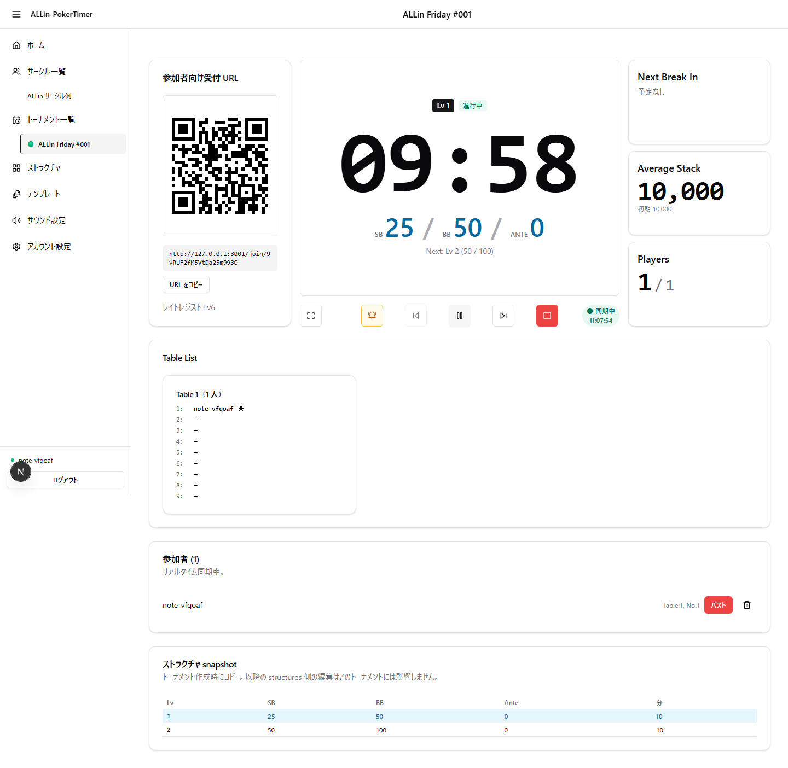

ポーカーサークルを運営したことがある人なら、たぶん一度は経験している。

- 「いまブラインドいくつでしたっけ？」が、今夜だけで 7 回飛んでくる。
- バストが出たので席を移そうとして、「誰が動くんだっけ？」で進行が 3 分止まる。
- そして、運営者である自分も、ハンドのど真ん中にいる。

ALLin-PokerTimer は、こうした「運営兼任のプレイヤー」がトーナメントを円滑に回すための、無料で使える NLH（ノーリミットテキサスホールデム）トーナメント進行アプリです。
6 テーブル以下・20 人前後のサークルを、TDA（トーナメントディレクター協会）ルール準拠でアプリが勝手に捌いてくれることを目指しています。

---

## このアプリが目指していること

> **熟練オペレーターを「効率化」するのではなく、熟練者が不在でも「規則通りに回る」ようにする。**

サークル運営の現実は、運営者が自分もプレイしながら全体も見ている、というもの。
ALLin-PokerTimer は **「席移動」「テーブルバランス調整」「ブラインド変更通知」をアプリ側が自動で指示する**ことで、運営者を「判断」から解放します。

---

## トップ画面：ログインしたら、もう運営の準備は半分終わってる

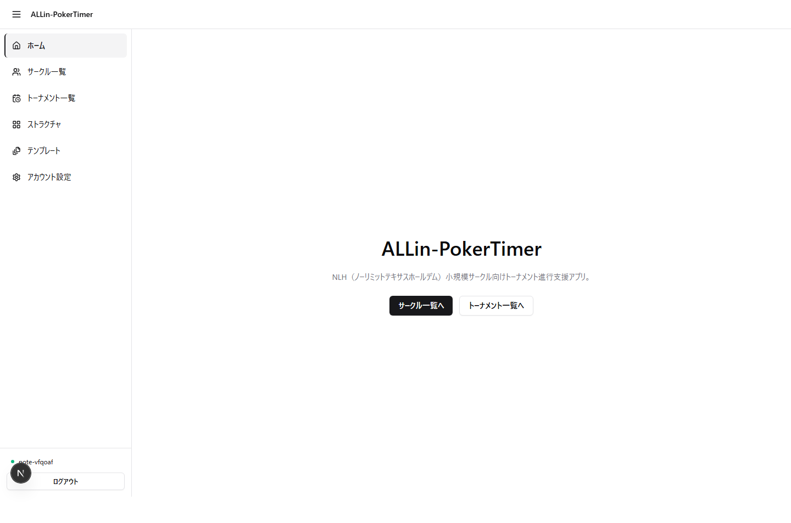

ログインすれば、すぐに「サークル一覧」「トーナメント一覧」へ。
左サイドバー（左上のメニューボタンから）には、当日触りたいもの——サークル・トーナメント・ストラクチャ・テンプレート・サウンド設定——が一階層に並びます。
迷子になりません。

---

## サークル単位でデータ共有：当日の運営者なら誰でも代行できる

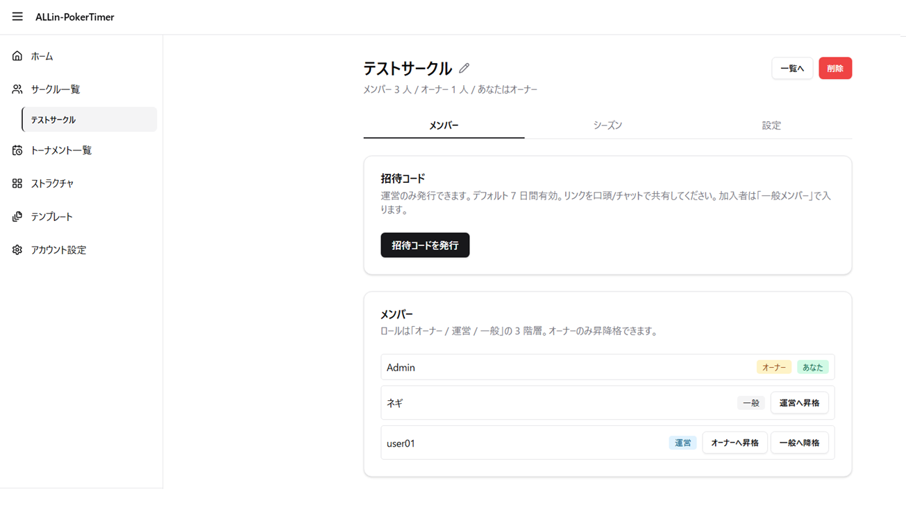

このアプリでは、ストラクチャもトーナメントも **サークル単位で共有** されます。
だから、当日プレイヤーを兼任している運営者が誰でも、開始ボタンを押せて、席を進められます。

メンバー権限は 3 種類：

- **オーナー** — サークル名や運営権限を管理
- **運営担当** — 当日の進行を担当
- **一般メンバー** — トーナメントの閲覧・参加のみ

招待はワンクリックで URL を発行（7 日間有効）。発行カードには **QR コードも自動表示**されるので、その場で読み取ってもらうのも、LINE や Discord に URL を貼って共有するのも好きな方で対応できます。

---

## トーナメント作成：ストラクチャを 1 度作れば、当日は名前と席数だけ

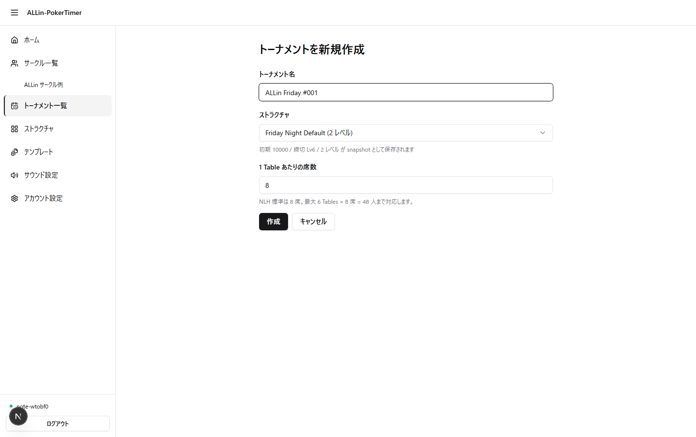

このアプリで開催を始めるには 2 段階の準備があります。

1. **事前に「ストラクチャ」（ブラインドの上がり方）を 1 つ作っておく** — サークルをまたいで使い回せるテンプレートを土台にすれば、ゼロから組まなくても大丈夫。最初に 1 つ用意すれば、以降は使い回せます
2. **当日はトーナメント作成画面で、用意済みのストラクチャを選んで席数を決めるだけ**

ストラクチャはサークル単位の財産になります。「Friday Night Default」のように 1 度作っておけば、毎回の当日運営はトーナメント名と席数を決めるだけの数十秒で終わります。

---

## 受付：QR を貼るだけ、参加者は 1 タップで席に着く

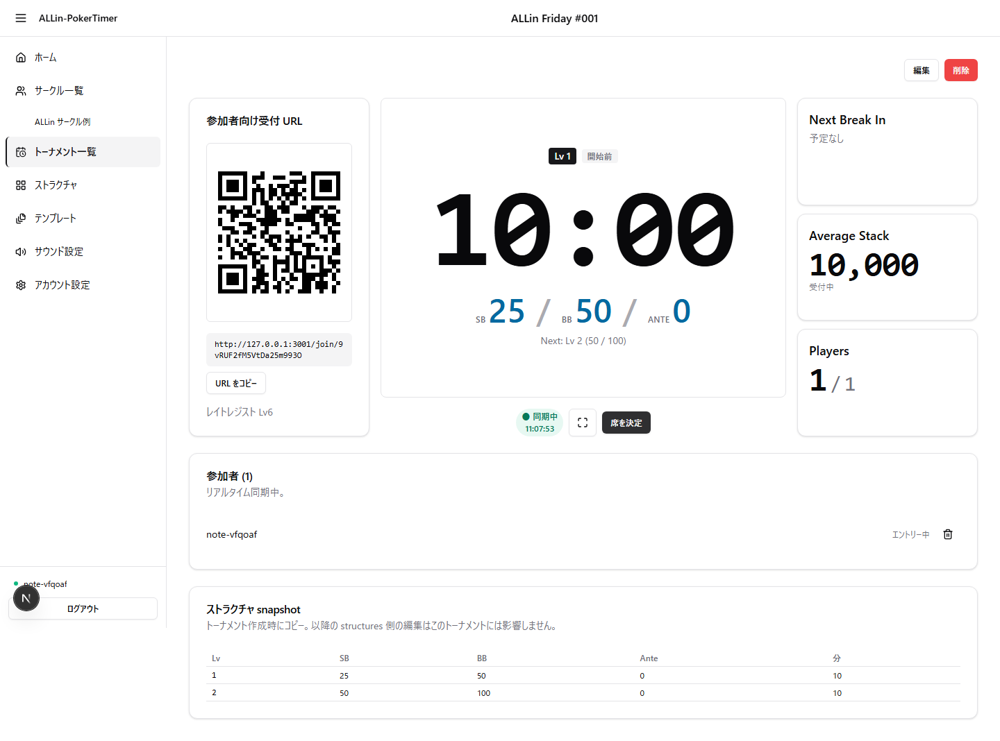

トーナメントを作ると、左上に **参加者用の受付 URL と QR コード** が常設されます。

参加者はスマホで QR を読むだけ。受付の方法は 3 つから選べます：

1. **Google で参加** — ポップアップで 1 タップ。表示名は Google プロフィールから自動取得
2. **メール+パスワードでログイン** — 既存アカウントで
3. **ゲスト参加** — 表示名だけ入力すれば OK（トーナメント終了後にアカウント情報は自動的に整理されます）

「このアプリ用にアカウント作ってください」と言わなくていいので、当日初参加の人でもストレスなし。

---

## ハイライト：ハンド中でも目に飛び込んでくるタイマー

これが、このアプリで一番見せたい画面。

中央のデカ文字タイマー、左の QR、右の **次の休憩までのカウント／平均スタック／生存人数**、下の **テーブル一覧**（誰がどこに座っているか）と**参加者一覧**——全部 1 画面に同居しています。

共有ディスプレイ の前に縛りつけられない兼任運営者のために、

- **アイコン化されたタイマー操作**（一時停止 / 前後レベル移動 / 終了 / 全画面表示）
- **ブラインド変更時のサウンド通知**（運営者の画面で鳴る／最初に 1 タップで有効化）
- **会場のサブモニター向けの投影画面**（同じトーナメントを別画面でも開ける）
- **ストラクチャ末尾へのレベル追加**（想定より人数が残ったときに、当日その場で延長できる）

を一通り揃えてあります。

そして、肝心の **席移動指示** は——
バストが出るとアプリがルールに基づき**「誰をどのテーブルに移動させるか」を画面に出します**。運営者は読み上げるだけ。「移動ルールを確認するために進行が止まる」が消えます。

---

## Tableの指定は番号より、参加者が見てすぐ分かる名前で

「Table 2 に移ってください」と運営者が言っても、参加者は会場のどれが Table 2 なのか分かりません。Tableの番号は運営者の頭の中にしか無いので、口頭で言われても参加者には伝わらない——これは実際の現場で起きた困りごとです。

解決策は単純で、**参加者が会場をパッと見渡してすぐ分かる呼び方**——「窓側の卓」「赤色の卓」「初心者卓」のような、**卓の特徴をそのまま名前にする**ことです。

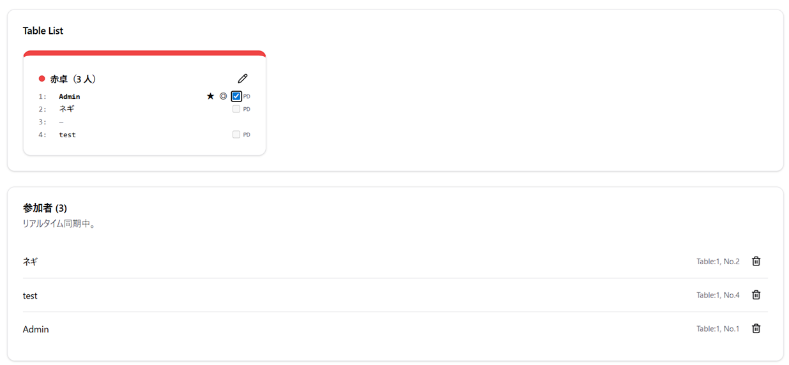

ALLin-PokerTimer は、卓ごとに **自由な名前と色** を設定できます。

- 卓のタイトル横の鉛筆アイコンから、名前をその場で書き換え——「Aフライト」「初心者卓」「赤卓」のように
- **10 色のプリセット** から色を選択（自分で好きな色を指定することもできます）。卓の上端に色の帯が付くので、会場でも色だけで一目で区別が付きます
- サークルの設定画面に **定番の卓名・色** を保存しておけば、毎回のトーナメントで自動的に使われます

「赤卓に移ってください」と言えば、参加者は会場を見渡して赤い帯の卓を探すだけ。番号を覚えていなくても、迷わず席に着けます。

---

## PD（プレイングディーラー）も、アプリが面倒を見る

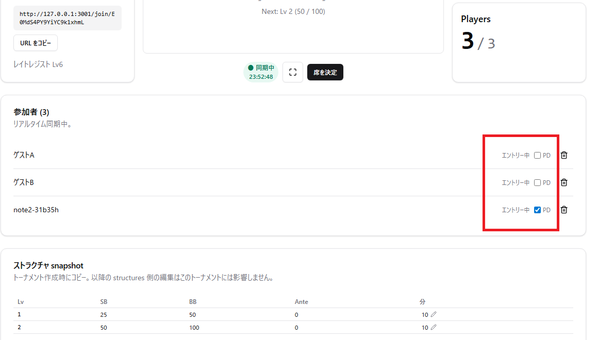

セルフディール卓で「今日はあなたが PD ね」と決まったら、参加者カードの PD チェックを ON にするだけ。

- **1 Table 1 PD 制約をアプリが強制**——同卓内でPDが複数人設定されることがない
- **バスト時 / 卓閉鎖時には PD が自動で外れる**ので、移動先でPDが重複しない

「PD 引き継ぎ忘れたまま卓が解散した」みたいな事故が、運用から消えます。

---

## 参加者のスマホは、自分の「進行係」になる

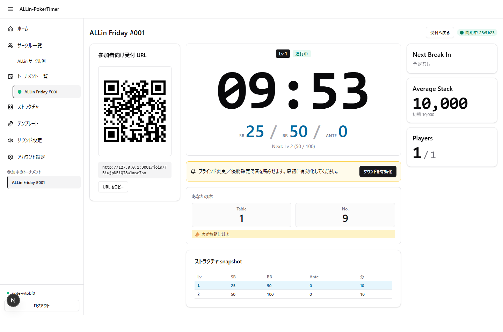

参加者は受付が終わると、自分専用のライブ画面がスマホ上のホームになります。

- **大きなブラインド表示**
- **「あなたの席」**セクション（バランシングで席が変わったら「席が移動しました」バッジが出る）。卓に付けた名前は参加者画面にも反映されるので、「赤卓 3 番」のような表記でそのまま着席できる
- **次のブラインド予告**（一覧で確認できる）

共有ディスプレイ が見える席にいない人でも、ブラインドアップに気付かない事故が起きません。

---

## 観戦モード — 会場の予備モニタ / レイトインしたい参加希望者 の手元に、ログインなしで届く

会場で本体機を触っている運営者の隣で、「予備モニタにタイマーと席表を映したい」「参加者希望者から『今レイトレジスト間に合う？』のチャットが飛んでくる」」のはよくあるシーンです。

ALLin-PokerTimer は、運営者が dashboard で **観戦モード** を ON にすると、 **ログインなしで誰でも開ける URL** を発行します。

- **タイマー / ブラインド / 残人数 / 席表 / レイトレジスト受付状況**が 1 画面に並ぶ
- URL コピーボタンと QR コードがセットで出るので、会場の予備モニタはその場で QR を読むだけ、遠方の人にはチャットに URL を貼るだけで届く
- 観戦中はトーナメント一覧に **「観戦モード ON 中」バッジ**が常時表示。終了後に OFF し忘れて公開しっぱなし、を見落とさない
- 観戦モードを OFF にした瞬間、開いていた URL は「観戦が終了しました」に切り替わり、それ以上は何も見えなくなります

「予備モニタ用に別アカウントでログインさせる」「参加希望者に状況をチャットで個別返信する」が、URL 1 つで解消します。

---

## 「同じメンバーで次の開催も」を 1 タップで

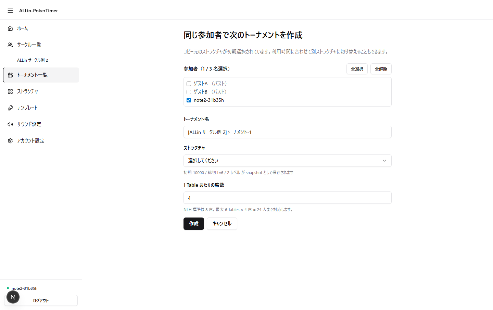

トーナメントが終わった画面には、**「同じ参加者で次のトーナメントを作成」** ボタンが出ます。

- 直前のトーナメントの参加者一覧から、来週も参加する人だけチェックを入れて作成
- 最大 50 人まで一括コピー。受付用の QR コードは新しいトーナメント用に作り直されるので、新たに参加する人もそこから入れます
- コピー直後はまだ受付前の状態で立ち上がるので、参加者の追加・削除の調整をしてから開始できます

「次回はまた最初から受付やり直し」が消えて、準備の手間がほぼゼロになります。

---

## シーズン戦績で、月 1〜2 回でも「次回が楽しみ」になる

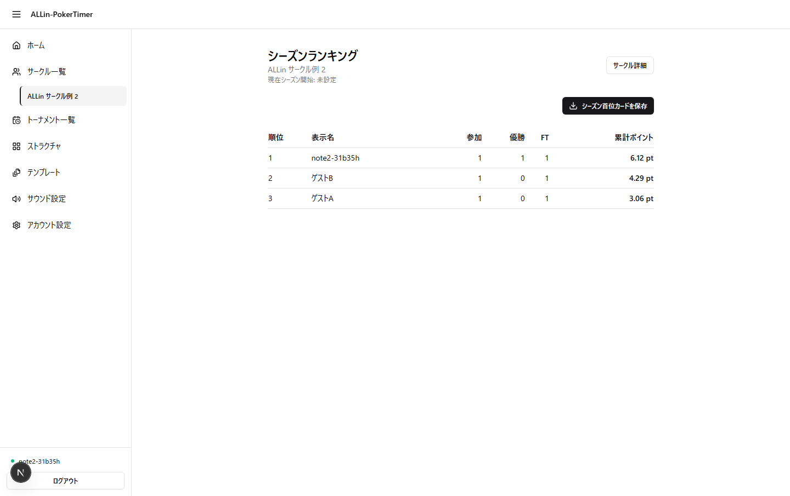

月 1 回開催のサークルだと、開催間隔が空くうちに「先月誰が勝ったっけ？」の記憶が薄れていく。
ALLin-PokerTimer は、サークル単位で **シーズン累計** を勝手に集計します。

- **参加回数 / 優勝回数 / FT（ファイナルテーブル）回数 / 累計ポイント** を、トーナメント終了と同時に取り逃しなく加算
- ポイントは **順位 × 参加人数係数** で計算。6 人開催の 1 位と 24 人開催の 1 位で、ちゃんと重みが付きます（**順位ごとの基礎点と基準人数は、運営者が好みに合わせて編集可能**）
- サークル詳細から **シーズンランキング**を全メンバーが閲覧可能
- シーズンの区切りは運営者の手動切替——「シーズン開始」ボタンを押すと、現状の戦績が **過去シーズンの記録として保存** され、新シーズンが始まります
- 過去シーズンは **履歴ページから個別に振り返れます**

「先月の 1 位は誰だったか」が、アプリ上で完結します。

---

## 結果は PNG にして、LINE / X にそのまま貼る

トーナメントが終わった瞬間、優勝者発表画面の **「画像を保存」ボタン** で優勝カードが PNG 画像として手元に。
シーズンランキング画面でも、**シーズン首位カードの画像** が同じく 1 タップで保存できます。
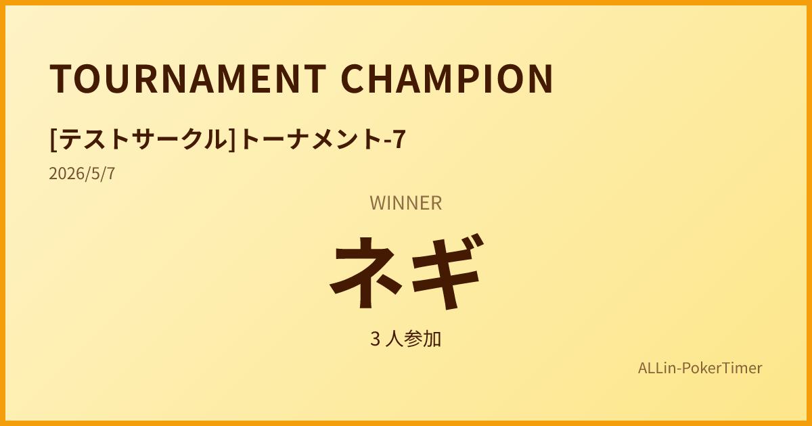

- 対応している端末では **スマホ標準の「共有」メニューから、LINE / X に 1 タップで送信** できます
- 対応していない端末では、自動的に画像のダウンロードに切り替わります
- スクリーンショットを撮って切り抜く必要はありません。最初から「サークル LINE に貼るための体裁」で出力されます

月 1〜2 開催で薄れがちな盛り上がりを、画像 1 枚でつなぎ止めます。

---

## ホーム画面に追加できるアプリ。会場 Wi-Fi が一瞬切れても、タイマーは止まりません

会場 Wi-Fi の不安定や、地下・鉄筋の建物でモバイル回線が一瞬切れる——会場あるあるです。これでブラインドが上がらなかったり画面が真っ白になると、トーナメント進行が止まります。

ALLin-PokerTimer は **PWA（ホーム画面に追加できるアプリ）** として動作するので、

- **ホーム画面のアイコン 1 タップで 起動**——URL バーもタブもない、専用アプリのような表示で立ち上がります
- **一時的な通信障害でもブラインドレベルは止まらない**——通信が戻った瞬間に自動で同期されます
- **画面消灯防止と横向きロック**をアプリ側で制御。会場プロジェクタ投影中に画面が暗転して焦る、が起きません
- 初回アクセス時に「ホーム画面に追加」のバナーが出るので、次回以降の起動所作は数秒で済みます

会場到着後の「ブックマークから開いて、Wi-Fi を確認して、ログインし直して…」が消えます。

---

## アカウント周りも、当日の運営者を煩わせません

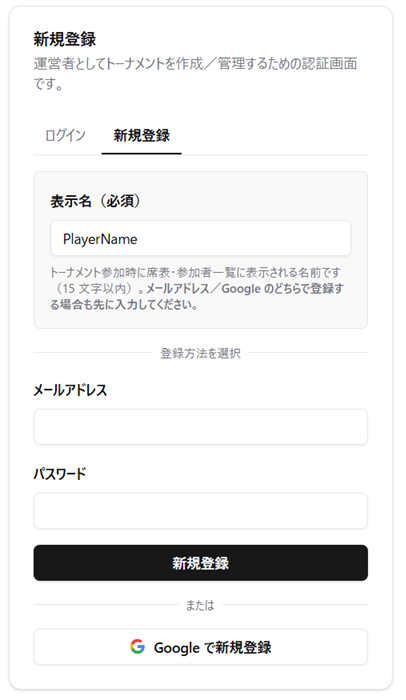

- メール+パスワードで登録したアドレスと、同じアドレスの Google アカウントが衝突しても、**自動でアカウント連携の確認画面**が立ち上がります
- アカウントを作らない **ゲスト参加** も可能。初参加の人がいきなりアカウント作成は・・・という人がいても安心です
- 表示名はどの登録方法でも必須。**席表に「名無しの参加者」みたいな冷たい表示が出ない**ように設計しています
---

## こんな人に届けたい

- ポーカーサークルの **運営兼プレイヤー**
- ポーカー歴は浅くないけれど、**運営ルールの細部までは覚えていない** 人
- 月 1〜2 回開催のサークルを、**追加コストゼロで** 回したい人
- 特別な機材は用意せず、**運営者の手元の端末（スマホでも PC でも）と、参加者のスマホだけ** できちんと回したい 人
- 「先月の優勝者は誰だったか」「来週も同じ顔ぶれで開催したい」を、**スクショや手書きノートに頼らずアプリ上で完結させたい** 人

次のサークル開催で、まずは試しに動かしてみてください。
