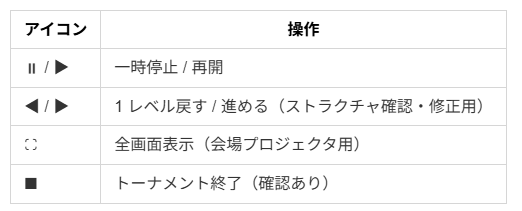
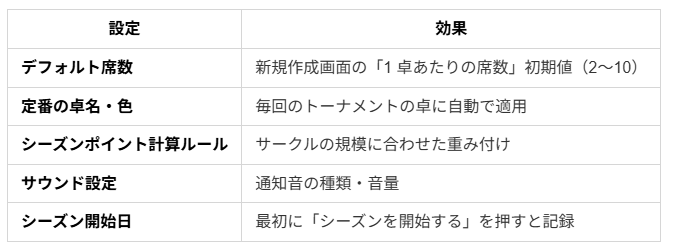
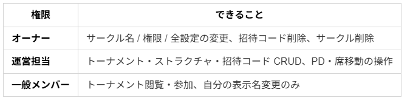
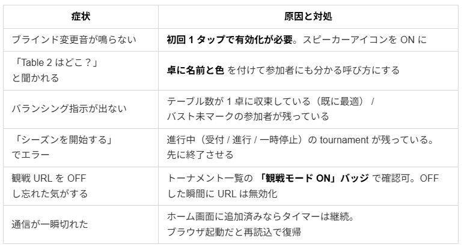

# ALLin-PokerTimer 運営チートシート — 「もう使ってる人」向けの操作ガイド

ALLin-PokerTimer をすでに 1 度でも回したことがある人向けに、**当日に迷う場面だけ**を順に並べたページです。
「あの操作どこだっけ」を 30 秒で解決することを目的に書いています。

> はじめての方 → [導入記事（こちら）](note-article.md)

---

## 最初の 1 回だけ: ホーム画面に追加しておく（強く推奨）

ブラウザのままでも全機能そのまま使えますが、**ホーム画面に追加しておくと当日が確実に楽**になります。
入れていない人は今このタイミングで 2 タップだけ済ませてしまうのを推奨。

- **アイコン 1 タップで起動** — URL バーもタブもない、専用アプリのような表示
- **会場 Wi-Fi が一瞬切れてもタイマーは止まらない** — 通信が戻った瞬間に自動で追いつく
- **画面消灯防止 + 横向きロック** — プロジェクタ投影中に画面が暗転して焦る、が起きない
- **ログイン状態が残る** — 起動のたびにログインし直さなくていい

→ 初回アクセス時に画面下部に出る **「ホーム画面に追加」バナー** から 2 タップ。
バナーを閉じてしまった場合はブラウザの共有メニュー → 「ホーム画面に追加」。

> 入れずに運用しても問題なく動きます。会場 Wi-Fi が安定していて、ブラウザ運用で困っていなければ任意。
> ただし **会場プロジェクタ投影 / 地下や鉄筋の建物** で開催する日は入れておく方が事故が減ります。

---

## 当日 5 ステップ（最短経路）

1. **トーナメント作成** — サークル詳細 → 「新規作成」 → ストラクチャ選択 → 席数 → 作成
2. **受付** — ダッシュボード左上の QR / URL を会場に貼る・チャットに流す
3. **開始** — 中央の「開始」 → 初期配席が自動で確定（席は参加者ライブ画面に通知）
4. **進行** — タイマーは自動。ブラインド変更音は **最初に 1 タップで有効化**（後述）
5. **終了** — 1 人を残してバスト → 自動で終了画面 → 画像保存・次回作成へ

> 当日「考える」のは 1 と 2 だけ。3 以降はアプリが指示を出します。

---

## 受付 — 参加者が QR を読んだ後

参加者は次の 3 つから選びます。運営者からの案内は不要。

- **Google で参加** — 1 タップ、表示名は Google 側から流入
- **メール+パスワード** — 既存アカウント
- **ゲスト参加** — 表示名だけで OK

> ⚠️ ブラウザの自動入力で表示名が空になりがち。受付で詰まったらゲスト参加を案内するのが早い。

---

## ブラインド変更時のサウンドを鳴らす

**初回だけ画面のサウンドアイコンを 1 タップで有効化が必要**（ブラウザの autoplay 制約）。

- ダッシュボード右上のスピーカーアイコンが OFF（斜線）→ タップで ON
- 1 度有効化すれば以降の昇格通知は自動で鳴る
- 通知音はサークル設定 → 「サウンド設定」 で変更可能

---

## 進行中のアイコン操作

ダッシュボード中央のアイコン群:

---

## バストが出たら

参加者リストの該当者を **「バスト」** ボタンでマーク。次が自動で起きます。

- 残人数 / 平均スタックが即時更新
- バランシングが必要なら **「○○さんを Table 2 → Table 3 へ」と画面に表示**
- 運営者は読み上げるだけ。ルール参照は不要

> 移動指示の根拠（TDA バランシング）はアプリが裁定しているので、議論で進行を止めずに済みます。

---

## PD（プレイングディーラー）の指定

- 参加者カード右端の **PD チェック** を ON にするだけ
- **同卓内 PD は 1 人まで**（アプリが排他制御）
- バスト時 / 卓閉鎖時に **PD は自動で外れる** ので引き継ぎ忘れ事故が起きない

---

## Table 名と色を変える

- 卓カードのタイトル横の **鉛筆アイコン** からその場で変更
- 色は **10 色プリセット + カスタム**。卓上端の帯で会場から一目で識別可
- サークル設定の **「定番の卓名・色」** に保存しておくと毎回自動適用

---

## 席数が想定より残った / レベルを足したい

ダッシュボード下部の **「レベルを追加」** から、ストラクチャの末尾に当日その場で延長できます。
延長分は **このトーナメント限定**で、元のストラクチャは変更されません。

---

## 観戦モード — 予備モニタ・参加希望者向け

ダッシュボード上部の **「観戦モード ON」** をトグル。

- 発行された URL は **ログインなしで誰でも開ける**
- URL コピーボタンと QR がセットで出るので、貼るだけ / 読ませるだけ
- 観戦中はトーナメント一覧に **「観戦モード ON」バッジ** が出るので OFF 忘れに気付ける
- OFF にした瞬間、開いていた URL は「観戦が終了しました」に切り替わる

> ⚠️ 不特定多数に拡散したい場合は念のため、サークル固有の参加者名が観戦画面で見える点を周知。

---

## 終了 → 画像保存 → SNS 共有

- 1 人を残してバスト → 自動で **優勝者発表画面** に遷移
- **「画像を保存」** ボタンで PNG ダウンロード
- 対応端末は **スマホ標準の共有メニュー** から LINE / X に直接送信可
- シーズンランキング画面の **首位カード**も同じ要領で保存可

---

## 同じメンバーで次回を即立ち上げる

優勝者発表画面 / 終了済みダッシュボードに **「同じ参加者で次のトーナメントを作成」** ボタン。

- 直前トーナメントの参加者から、次回も来る人だけチェック
- 最大 50 人まで一括コピー
- コピー後は **受付前（setup 状態）** で立ち上がるので、追加・削除の調整 OK
- 受付 QR は新トーナメント用に再発行されるため、新規参加者もそこから入れる

---

## シーズン管理

シーズン累計（参加 / 優勝 / FT / ポイント）は **トーナメント終了と同時に自動加算**。手動の集計は不要です。

### シーズンの区切りを変えたいとき

- サークル詳細の **「シーズンを開始する」** ボタン
- 押した瞬間、現状の戦績が **過去シーズンとして履歴保存** され、新シーズンが 0 から始まる
- ⚠️ 進行中のトーナメント（受付・進行中・一時停止）があると **エラーで止まります**。先に終了させてから押す

### ポイント計算式を変えたい

- サークル詳細 → 「シーズンポイント計算ルール」 → 編集
- 順位ごとの基礎点（最大 9 位まで）と基準人数（2〜10 人）を変更可
- 過去シーズンには遡及しません。区切りたい場合は「シーズンを開始する」で reset

---

## サークル設定で「毎回の手間」を減らす

サークル詳細画面で **1 度だけ** 設定しておくと、以降のトーナメント作成が秒で終わるもの:

---

## メンバー権限の早見表

招待コードから加入した人は **必ず「一般メンバー」スタート**。運営担当に上げるのはオーナー操作。

---

## よくあるつまづきと対処

---

## 困ったら

- アカウントの自己削除は `/settings` から（自分が唯一のオーナーのサークルがある場合は先に権限委譲が必要）
- 不具合報告 / 機能要望は noteコメントへの書き込みまたは X アカウントへコメントしてね
